# Art Catalog App 🎉🎉
Art Catalog App is an app that allows users to navigate the catalog of artworks exposed by the [Art Institute of Chicago API](https://api.artic.edu/docs/#introduction).

The app runs from API 24 and above, just clone the project and run it as you normally run an Flutter project.

## ⚙️ Architecture
The architecture used for the application consists of the following:

- Clean Architecture.
- Repository pattern.
- BLoC pattern using Cubit.

## 📚 Tech stack
- [Http](https://pub.dev/packages/http): A composable, Future-based library for making HTTP requests
- [Get It](https://pub.dev/packages/get_it): A simple Service Locator for Dart and Flutter projects with some additional goodies.
- [Freezed](https://pub.dev/packages/freezed): Code generator for data-classes/unions/pattern-matching/cloning.
- [Equatable](https://pub.dev/packages/equatable): A Dart package that helps to implement value based equality without needing to explicitly `override == and hashCode`.
- [Json Annotation](https://pub.dev/packages/json_annotation):Defines the annotations used by json_serializable to create code for JSON serialization and deserialization.
- [Build Runner](https://pub.dev/packages/build_runner): A build system for Dart code generation and modular compilation.
- [Isar](https://pub.dev/packages/isar): Extremely fast, easy to use, and fully async NoSQL database for Flutter.
- [Auto route](https://pub.dev/packages/auto_route): A declarative routing solution, where everything needed for navigation is automatically generated for you.
- [Flutter Bloc](https://pub.dev/packages/flutter_bloc): Widgets that make it easy to integrate blocs and cubits into Flutter.
- [Flutter local notifications](https://pub.dev/packages/flutter_local_notifications): A cross-platform plugin for displaying local notifications.
- [Shimmer](https://pub.dev/packages/shimmer): A package provides an easy way to add shimmer effect.
- [Mocktail](https://pub.dev/packages/mocktail): Mock library for Dart inspired by mockito.
- [Bloc test](https://pub.dev/packages/bloc_test):A Dart package that makes testing blocs and cubits easy.

## 🧱 Project Structure
```sh
.
├── data
│   ├── db
│   ├── mappers
│   ├── models
│   ├── network
│   ├── repository
│   └── utils
├── di
├── domain
│   ├── models
│   └── repository
├── helpers
└── ui
    ├── navigation
    ├── screens
    └── widgets
```

### Data Package
- `db` contains the class related to local storage with Isar.
- `mappers` as the name suggests, this folder contains the required files to pass the info from the API response to the domain models in the project.
- `models` data class files for the API call response.
- `network` representation for the API Network client calls.
- `repository` class implementation for each interface call declared in `Domain package`.
- `utils` contains a Result Wrapper(CallResponse) and constant values used in `network`.

### Di Package
- contains the `injection_container` class related to dependency injection.

### Domain Package
- `models` data class files for the API call response as we need it in the app.
- `repository` interfaces that define the use case to be performed by `Data package`.

### UI Package
- `navigation` holds the navigation logic used on the app.
- `screens` contains files that represents each screen, includes screen, cubit and state.
- `widgets` reusable UI components that can be used throughout the application.

### Helper Package
- contains the `notification_helper` which is a class to handle notifications.

## 🧪 Testing
This project includes unit tests for:
  - Cubits
  - Mappers
  - Repository

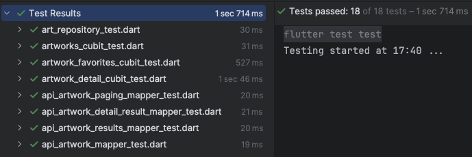

And UI tests with [Maestro](/maestro_tests)

## 🖼️ Android Images
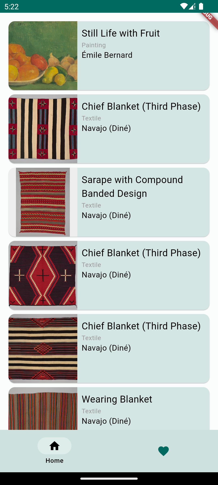
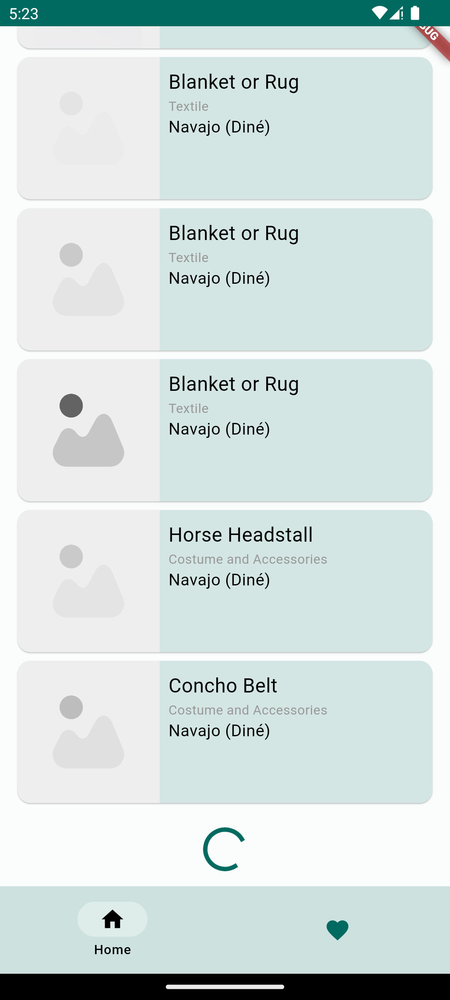
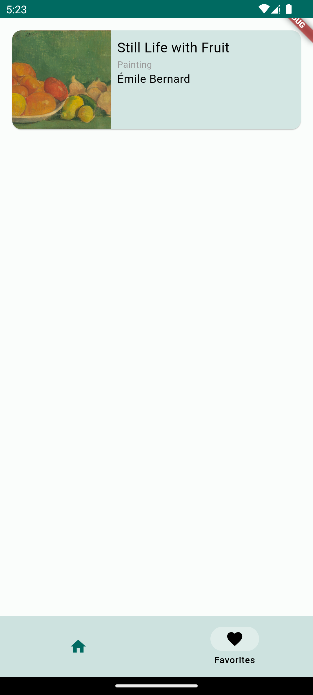
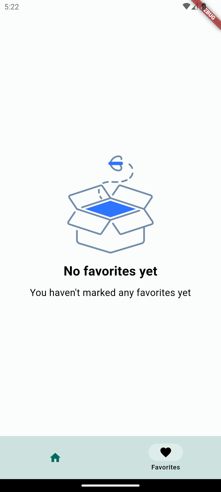
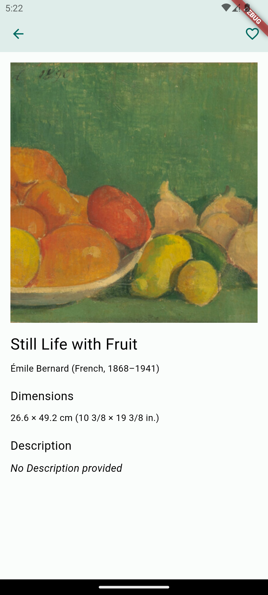
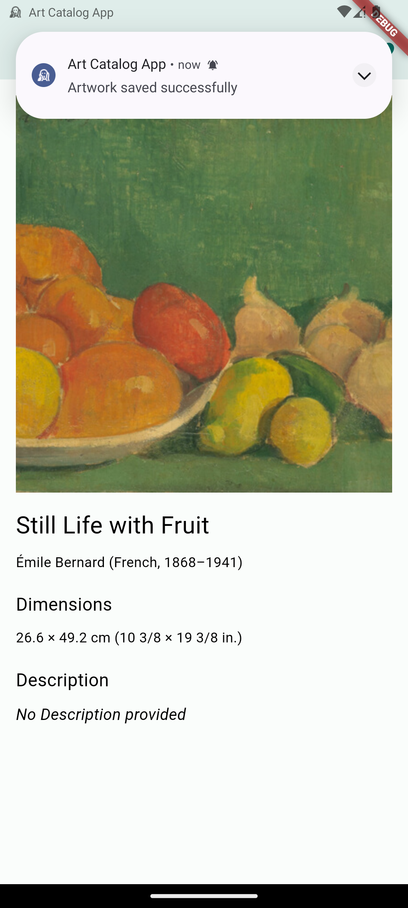
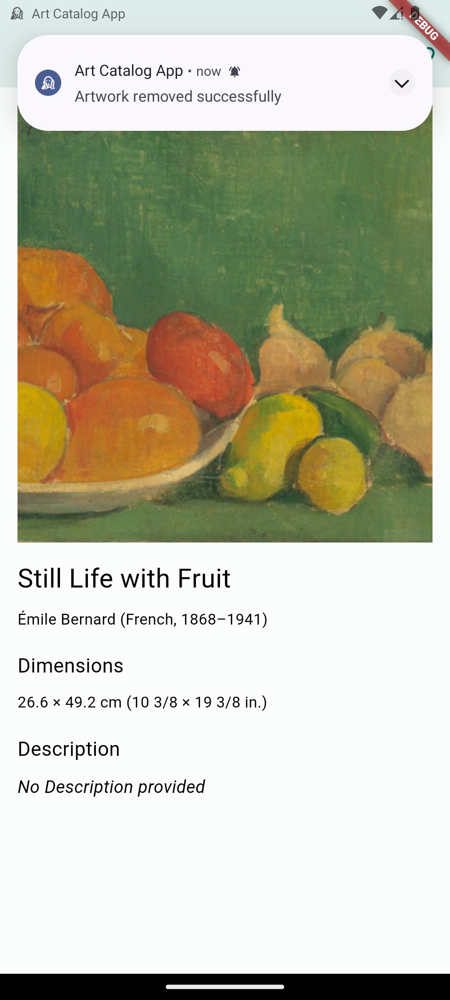
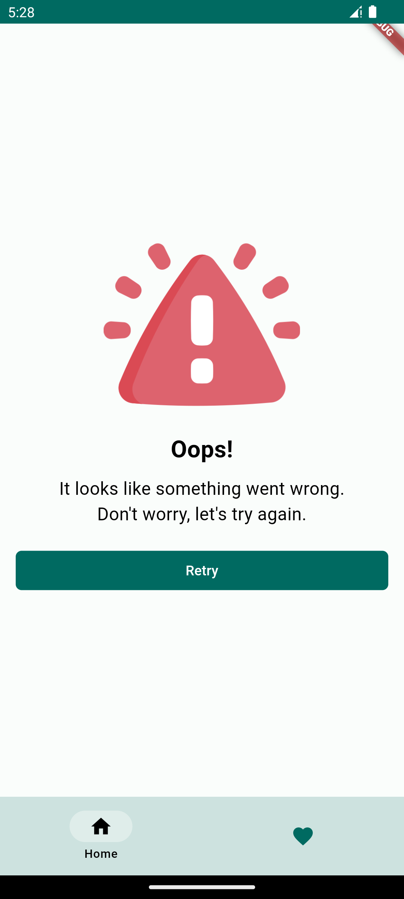

## 🖼️ iOS Images
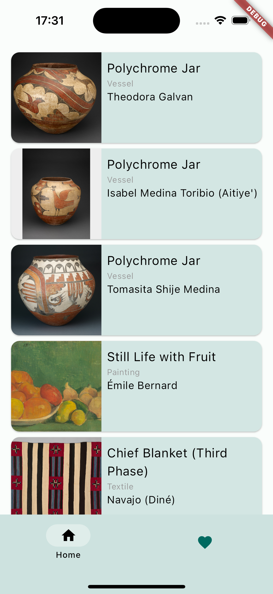
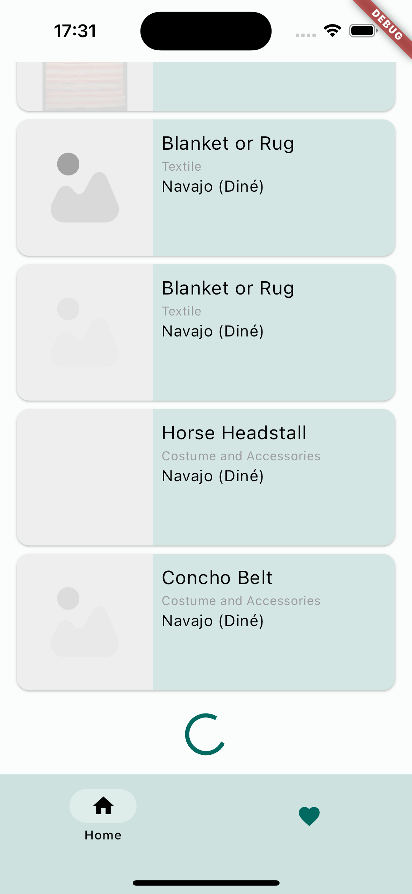
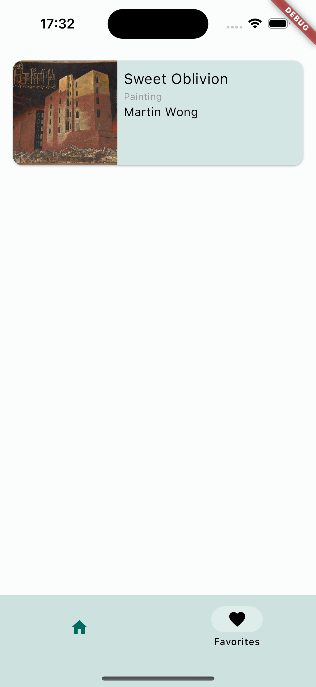
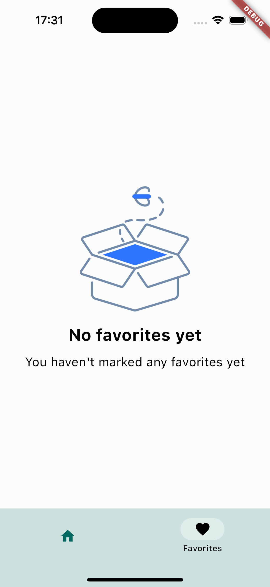
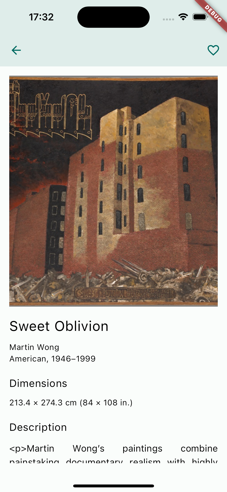


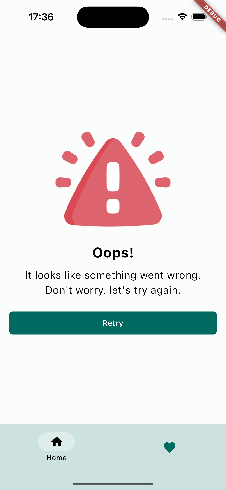


## 📓 Notes and considerations
- Most of the colors where taken from the original website, but I'm not an expert 😅.
- warning image taken from [here](https://www.flaticon.com/free-icon/warning_2797387?term=error&page=1&position=5&origin=search&related_id=2797387)
- placeholder image taken from [here](https://www.flaticon.com/free-icon/image_9261484?term=image+placeholder&page=1&position=28&origin=search&related_id=9261484)
- empty_box image taken from [here](https://www.freepik.com/icon/empty-box_7486744)
- logo image taken from [here](https://www.visualpharm.com/free-icons/edvard%20munch-595b40b75ba036ed117d7cf3)
- no_image icon taken from [here](https://www.flaticon.com/free-icon/no-image_11305479)
